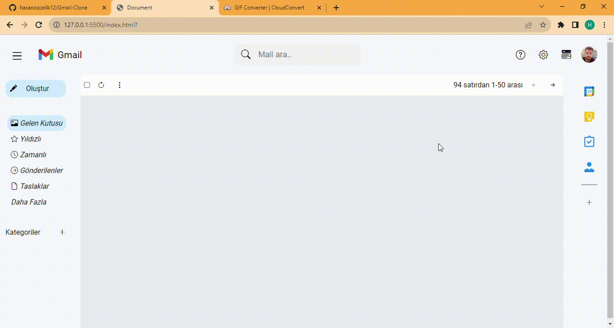

## İn this Project :
• The data was saved in localStorage so that the mails will appear on 
the screen when the screen is updated.
• It was deleted from the localstorage to remove it from the screen. Responsive for the page layout was made.

## Screen

